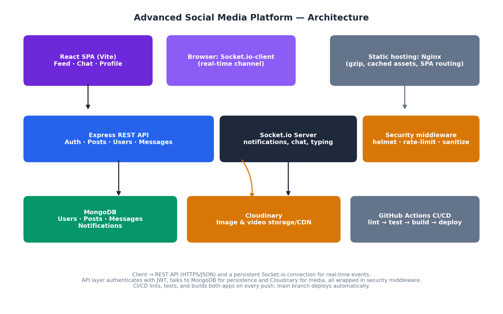

# Connectly — Advanced Social Media Platform

A full-stack, real-time social media platform built with React, Node.js,
Express, Socket.io, and MongoDB. Users can post text/photos/videos, like and
comment, follow each other, chat live, and get instant notifications —
all secured, tested, and deployable via Docker and GitHub Actions.



## Table of contents

- [Features](#features)
- [Tech stack](#tech-stack)
- [Project structure](#project-structure)
- [Getting started](#getting-started)
- [Environment variables](#environment-variables)
- [Running with Docker](#running-with-docker)
- [Testing](#testing)
- [CI/CD](#cicd)
- [Security](#security)
- [Performance & SEO](#performance--seo)
- [Screenshots](#screenshots)
- [Further documentation](#further-documentation)

## Features

- **Real-time notifications & chat** — Socket.io, JWT-authenticated handshake,
  typing indicators, instant like/comment/follow/message notifications.
- **Image & video uploads** — Cloudinary-backed, streamed from the server,
  validated by file type and size.
- **Social graph** — posts, likes, comments, follow/unfollow, profiles.
- **Advanced authentication** — JWT + httpOnly cookies, bcrypt hashing,
  brute-force lockout after repeated failed logins.
- **Comprehensive test suite** — Jest/Supertest (backend), Vitest/React
  Testing Library (frontend).
- **Security hardening** — helmet, rate limiting, NoSQL-injection
  sanitization, XSS cleaning, HTTP parameter pollution protection.
- **Performance** — route-based code splitting, vendor chunk separation,
  gzip compression, long-lived caching for static assets.
- **CI/CD** — GitHub Actions pipeline: lint → test → build → Docker → deploy.

## Tech stack

| Layer | Technology |
|---|---|
| Frontend | React 18, Vite, React Router, Axios, Socket.io-client |
| Backend | Node.js, Express, Socket.io, Mongoose |
| Database | MongoDB |
| Media storage | Cloudinary |
| Auth | JSON Web Tokens, bcrypt |
| Testing | Jest, Supertest, Vitest, React Testing Library |
| DevOps | Docker, Docker Compose, GitHub Actions, Nginx |

## Project structure

```
├── frontend/              React SPA (Vite)
├── backend/               Express REST API + Socket.io server
├── tests/                 Test suite documentation (see tests/README.md)
├── docker/                docker-compose.yml for the full stack
├── .github/workflows/     CI/CD pipeline
├── portfolio-website/     Standalone portfolio page for this project
├── resume/                Resume bullet points & talking points
├── docs/                  Full project documentation, screenshots, PDF
└── architecture-diagram.png
```

## Getting started

Prerequisites: Node.js 18+, a MongoDB instance (local or Atlas), and a free
[Cloudinary](https://cloudinary.com) account for media uploads.

### 1. Backend

```bash
cd backend
cp .env.example .env     # then fill in MONGO_URI, JWT_SECRET, CLOUDINARY_* keys
npm install
npm run dev               # starts on http://localhost:5000
```

### 2. Frontend

```bash
cd frontend
cp .env.example .env      # defaults already point at localhost:5000
npm install
npm run dev                # starts on http://localhost:3000
```

Open `http://localhost:3000`, register an account, and start posting.

## Environment variables

See `backend/.env.example` and `frontend/.env.example` for the full list.
At minimum you need:

- `MONGO_URI` — your MongoDB connection string
- `JWT_SECRET` — any long random string
- `CLOUDINARY_CLOUD_NAME`, `CLOUDINARY_API_KEY`, `CLOUDINARY_API_SECRET` —
  from your Cloudinary dashboard

## Running with Docker

Spins up MongoDB, the backend, and the frontend together:

```bash
cd backend && cp .env.example .env   # fill in real Cloudinary keys first
cd ../docker
docker compose up --build
```

Frontend: `http://localhost:3000` · Backend health check: `http://localhost:5000/api/health`

## Testing

```bash
# Backend
cd backend && npm test

# Frontend
cd frontend && npm test
```

See [`tests/README.md`](./tests/README.md) for what each suite covers and
how to test the real-time features manually.

## CI/CD

Every push and pull request triggers [`.github/workflows/ci-cd.yml`](./.github/workflows/ci-cd.yml),
which lints and tests both apps, builds the production frontend bundle, and
builds both Docker images. Pushes to `main` additionally run a deploy job
(replace the placeholder step with your actual hosting target).

## Security

- Passwords hashed with bcrypt (cost factor 12); never stored or logged in
  plaintext.
- JWTs delivered via httpOnly, sameSite cookies (mitigates XSS token theft
  and CSRF) as well as the Authorization header for API clients.
- `express-rate-limit` throttles all API traffic, with a stricter limit on
  `/api/auth/*`; repeated failed logins lock an account for 15 minutes.
- `helmet`, `express-mongo-sanitize`, `xss-clean`, and `hpp` guard against
  common HTTP/header attacks, NoSQL injection, and XSS payloads.
- Request bodies capped at 10kb to reduce JSON-based DoS risk.

## Performance & SEO

- React.lazy + Suspense splits every route into its own chunk (verified:
  production build produces separate `Login`, `Feed`, `Chat`, `Profile`
  chunks loaded on demand).
- Vendor libraries (`react`, `react-dom`, `react-router-dom`) and
  `socket.io-client` are split into their own long-term-cacheable chunks.
- Production assets are gzip-compressed and served with `Cache-Control:
  immutable` for a year via the Nginx config.
- `react-helmet-async` sets per-page `<title>` and meta tags; `index.html`
  ships Open Graph tags for link previews.

## Screenshots

| Feed | Chat | Login |
|---|---|---|
|  |  |  |

## Further documentation

The full write-up — architecture rationale, how each technical requirement
was met, testing strategy, deployment process, and career-prep notes — lives
in [`docs/documentation.pdf`](./docs/documentation.pdf) (also available as
[`docs/documentation.md`](./docs/documentation.md)).
